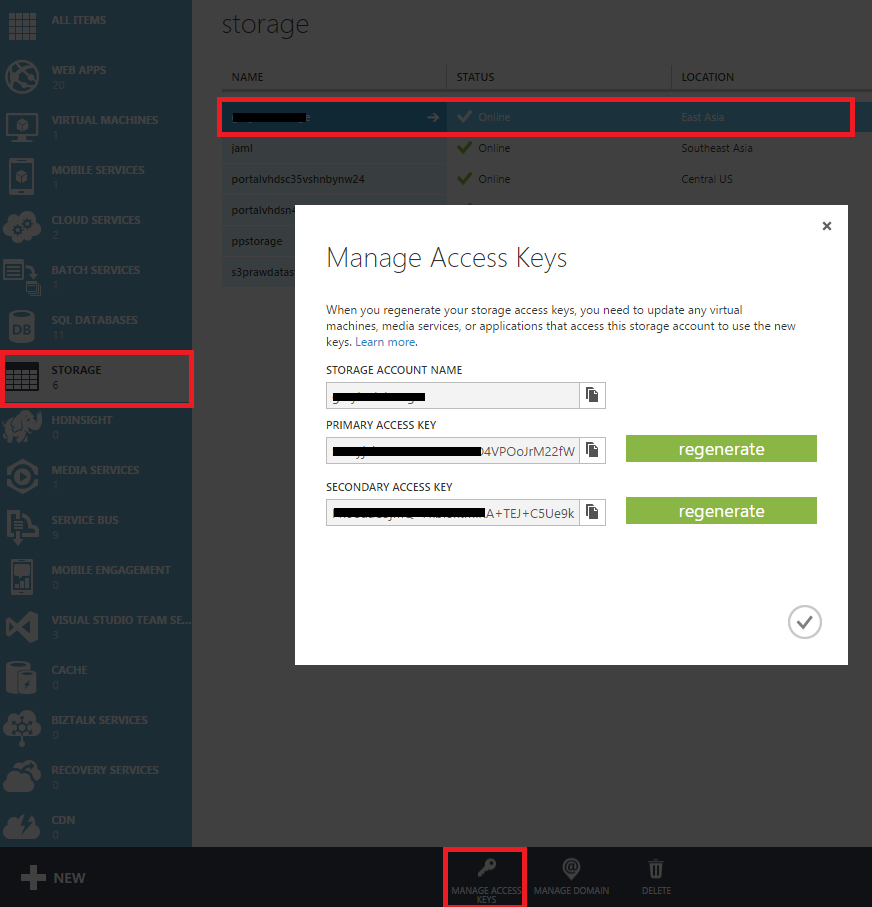
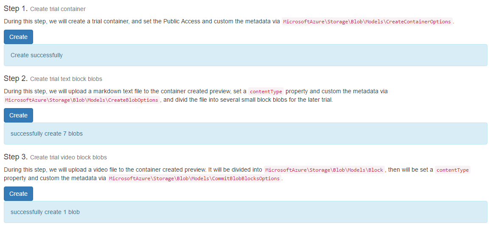
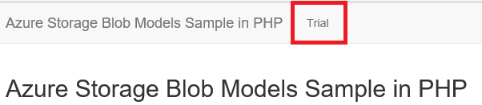
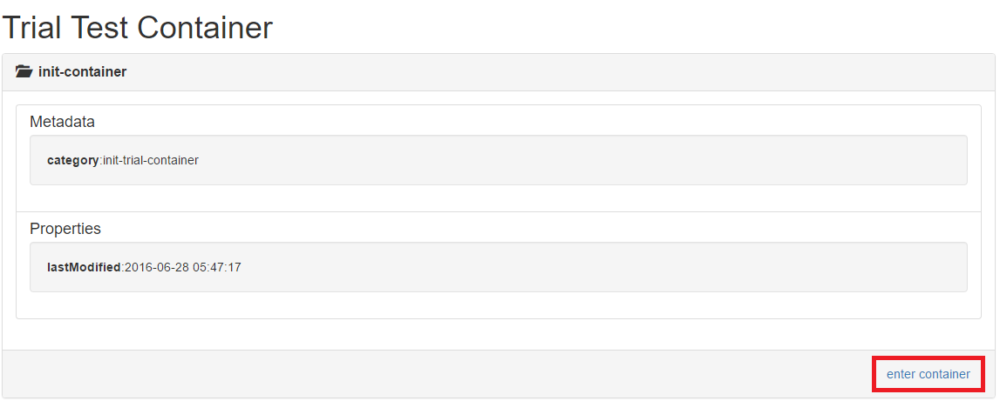
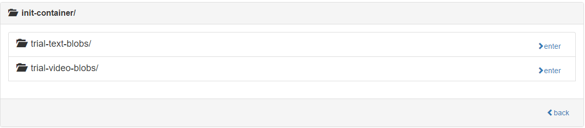
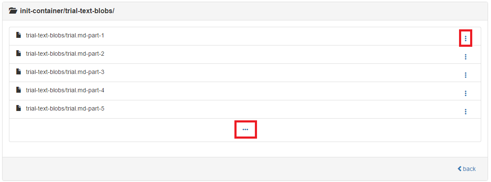
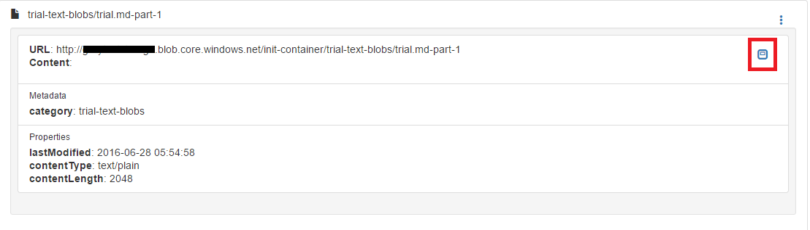
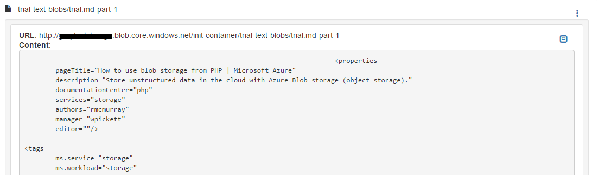
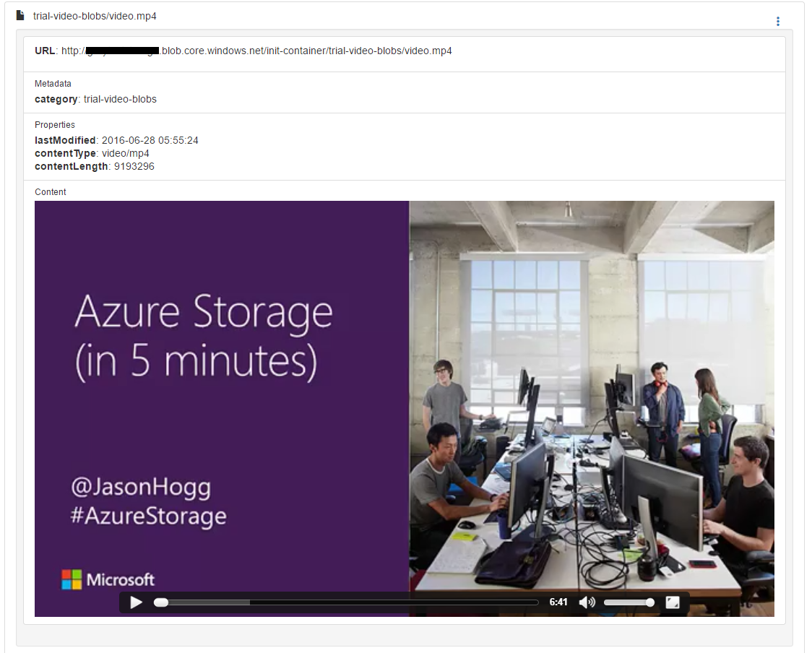

# How to use Azure Blob Storage modules by PHP

## Introduction
This PHP sample application demonstrates how to make a good use of the modules provided by Microsoft Azure Blob Storage SDK. In addition, Microsoft Azure Storage SDK for PHP resource code can be found on [Azure GitHub repository](https://github.com/Azure/azure-storage-php).

For now, the Azure Storage SDK for PHP shares almost the same interface with storage blobs, tables and queues APIs in Azure SDK for PHP. However, there are some minor breaking changes that need to be addressed during your migration.

- Remove all the pear dependencies including HTTP\_Request2, Mail\_mime, and Mail\_mimeDecode. Use Guzzle as underlying http client library.
- Change root namespace from "WindowsAzure" to "MicrosoftAzure/Storage".
- If the set metadata operations contain invalid characters, a ServiceException with 400 bad request errors instead of Http\_Request2\_LogicException will appear.

This code sample is separated into two tiers. The frontend is built using AngularJs. AngularJs source code scripts are in __src__ folder, and are combined with br gulp. The backend is built using PHP and implementing with Azure storage SDK for PHP. All the operations on Azure Blob Storage in the frontend are called via __$http__ module, which is against the functions in PHP backend.

All the functions that are called via frontend are listed in this single script as __trial.php.__ The function first parses the URL param key to determine which kind of resources the client end is requesting, creating/initializing or trailing the code sample.

If the URL params have the key "init", it means the client end is asking for the initialization of the code sample.

Switch the param value in following cases:  

- "container" - get the trial container, its metadata and properties.
- "blob" - list the trial blobs, its metadata and properties with pagination.
- "content" - streaming output the content of the specified blob.

## Building the Sample

- Before running this code sample, please open __settings.php__ in the __api__ directory.  
Here we need the storage account name and access key for setting up a correct configuration. To get your storage account and access key, please login [Azure Manage Portal](https://manage.windowsazure.com/), click the __STORAGE__ in the left navigation bar, select your storage account in the right side list, click the __Manage Access Keys__ button in the bottom bar.  
	

  - Replace __ACCOUNT\_NAME__ with your storage account in __settings.php__.
  - Replace __ACCOUNT\_KEY__ with the storage account key in __settings.php__.
- Make sure your PHP runtime has enabled the extension __"fileinfo"__. To check this, you can use __"phpinfo()"__ function in PHP script or run command __"php -m"__ in cmdlet.
- (Optional) You can use [WebMatrix](http://www.microsoft.com/web/webmatrix/) to work with this PHP sample. WebMatrix is a free and light-weight tool that will let you create web sites using various technologies like PHP, Asp.Net, Node.js etc. In order to run this sample in Web matrix, you can choose "Open Site", then choose "Folder as Site" and select the folder that contains all the downloaded files.
- (Optional) You can use [PHP Build-in web server](http://php.net/manual/en/features.commandline.webserver.php) for a quick local test. Use following command in cmdlet from the code sample directory:

	`php -S localhost:8000`

## Tour the sample

- Click 3 __Create__ buttons in the home page to create the container and blobs resources in your Azure storage. The result of the operations will be directly output in the block under the buttons:

	

- Click the __trial__ button in the top navigation bar to start trailing the code sample.

	

	Then it will redirect to the page that shows the container info.  
	 

- Enter the container, redirect the page that shows the blob list separated by delimiter /, which can be treated as a virtual directory.

	

- Enter the virtual directory of text blobs lists.

	

- Click the horizontal spots button to get paginated blobs. Click the vertical spots button to show the details of the blob.

	

- Click the disk-like button to get the content of the text blob.

	

- Back to the root of the container, enter the video blobs virtual directory to trail the video blobs.

	 

## More Information and Resources

- Azure Storage SDK for PHP: [https://github.com/Azure/azure-storage-php](https://github.com/Azure/azure-storage-php)

- Microsoft Azure storage documents: [https://azure.microsoft.com/en-us/documentation/services/storage](https://azure.microsoft.com/en-us/documentation/services/storage)

Technologies | Topics | Platforms | Requirements | Primary language | Updated | License
--- | --- | --- | --- | --- | --- | ---
JSON, REST, PHP, AngularJs | REST, Microsoft Azure SDK for PHP, AngularJs | Web, Cloud, Storage | <ul><li>PHP 5.5 or above</li><li>An Azure storage account</li><li>Composer & Npm</li><li>Gulp manage client scripts</li></ul> | en-US | 6/28/2016 | <a href="./LICENSE">MIT</a>
